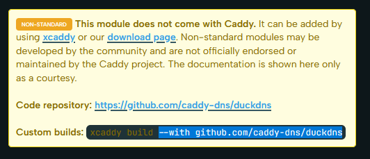
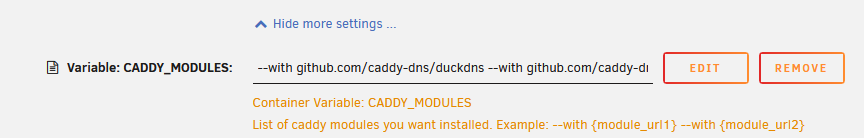
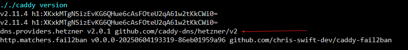
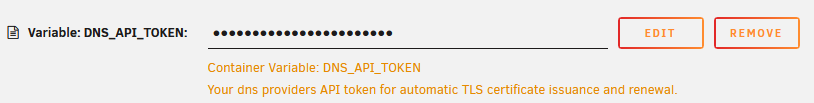

# DNS challenge
The DNS challenge can be used to prove that you control a specific domain to a Certificate authority.
The major advantage of this challenge is that unlike the HTTP or TLS-ALPN challenge it does not require any open ports.
This is particularly usefull if you don't want to do any port forwarding or if your ISP blocks incoming traffic on port 80 and 443.

A more detailed explanation on this challenge can be found in the [Caddy documentation](https://caddyserver.com/docs/automatic-https#dns-challenge)

## Adding your dns provider module
The DNS challenge requires Caddy to place a TXT record in your DNS configuration.
To do this Caddy needs to be able to communicate with you DNS provider.
The [Caddy Modules page](https://caddyserver.com/docs/modules) on the official website contains a list of available DNS provider modules.

Find your DNS provider in the list go to it's page and copy the xcaddy build parameter as seen below.
See [Forwarding the challenge](#optional-forwarding-the-challenge) if your provider is not in the list.



Then edit your unraid container config and paste this parameter into the `CADDY_MODULES` environment variable.
You may need to click `show more settings ...` to see this textbox.
You can delete the default values if these are not needed.



Then click apply and check the container log.
If all went well then the log should contain your newly installed dns provider in the caddy version output.



This example shows the Hetzner dns provider module has been added.

## Setting the API key

Most DNS provider modules need some method to authenticate themselves and set the TXT record.
This differs for each DNS provider. The most common method is an API key.
[Check the documentation](#getting-an-api-key) of your provider module for details.

After you have obtained you API key edit your container config again.
Find the `DNS_API_TOKEN` environment variable, paste your API key into it and click apply.



### Getting an API key
List of DNS provider API docs.
* DuckDNS token can be found on main page after logging in.
* [Hetzner](https://docs.hetzner.com/cloud/api/getting-started/generating-api-token/)
* >Help complete this tutorial by submitting more links.

## Caddyfile configuration
The last step is configuring Caddy to use the DNS provider to request certificates.

The [example](#example-caddyfile) contains all the options required.
The following need to be changed:
* In the global options block:
	* acme_ca: uncomment and set to `https://acme-staging-v02.api.letsencrypt.org/directory` for testing. This prevents you from getting rate limited if anything is misconfigured. (Don't forget to unset this after you have confirmed everything works)
	* email: Replace with your email adress.
	* dns: Replace `YOUR_PROVIDER` with your dns provider(usually lowercase, see the module docs).
* The siteblock domain name
	* In the tls options block of your site:
		* propagation_delay: Delay to wait for DNS propagation. If your DNS updates fast you can set this lower.
		* resolvers: Set this to the DNS server that de Certificate authority should use to check for the TXT record.
		* override_domain(Optional): See [Forwarding the challenge](#optional-forwarding-the-challenge). 


## (Optional) Forwarding the challenge
If there is no module for your DNS provider you can forward the challenge to a provider that does have a module available.
My recommendation is to use DuckDNS for this usecase.

First add the module of the DNS provider that you want to forward to as seen in [Adding your dns provider module](#adding-your-dns-provider-module).

Then add a CNAME record for the `_acme-challenge` subdomain to your primary domain.
This record will reference the secondary domain where the TXT record can be found.
An example to forward to DuckDNS would look like:
```
CNAME _acme-challenge.primarydomain.com  --->  yoursubdomain.duckdns.org
```

In your Caddyfile in the `tls` settings block for your primare domain, set the `override_domain` to the domain you have forwarded your challenge to.
This tells Caddy to set the TXT record in that domain.
See the commented line in the [Example](#example-caddyfile).

## Example Caddyfile

```
{
    # Uncomment line below to enable debug output
	#debug
	# Uncomment line below to enable staging
	#acme_ca https://acme-staging-v02.api.letsencrypt.org/directory

	email YOUR@email.org

	dns YOUR_PROVIDER {env.DNS_API_TOKEN}
	acme_dns
}

# Reusable recommended security settings
(security_headers) {
	header {
		Strict-Transport-Security "max-age=31536000; includeSubDomains;"
		X-Frame-Options "SAMEORIGIN"
		X-Content-Type-Options "nosniff"
		Referrer-Policy "strict-origin"
		X-Robots-Tag "noindex, nofollow, nosnippet, noarchive"
	}
}

YOURDOMAIN.org {
	tls {
		propagation_delay 120s
		resolvers 1.1.1.1
		#override_domain yoursubdomain.duckdns.org  # Uncomment and update this line if you want to forward your DNS challenge 
	}
	import security_headers
	
	respond "It's WORKING!!!!"
}
```